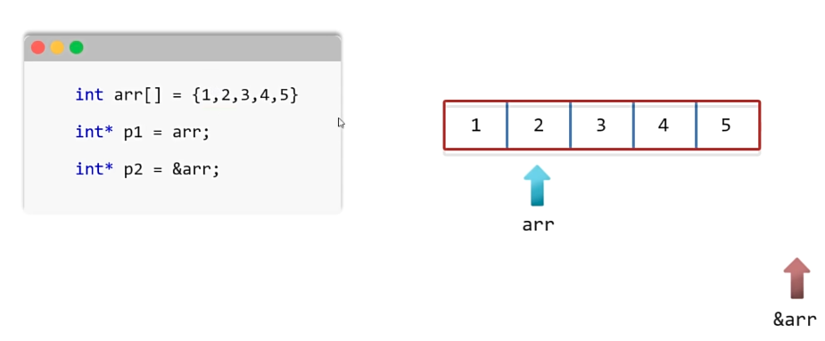
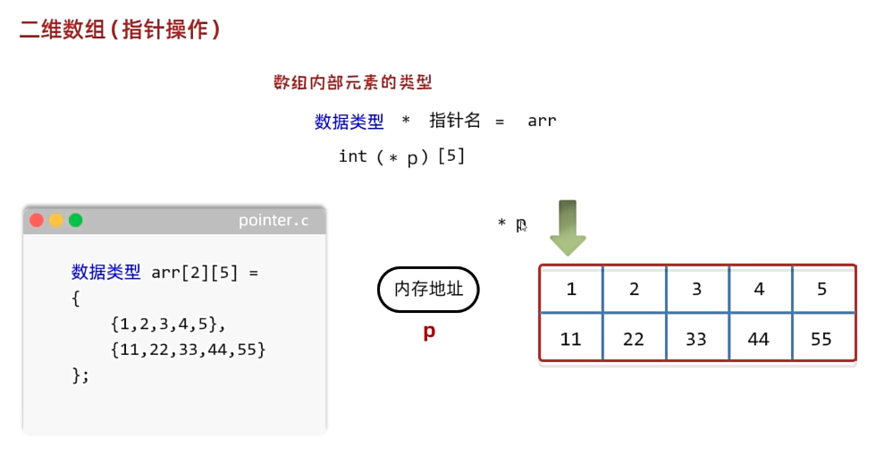
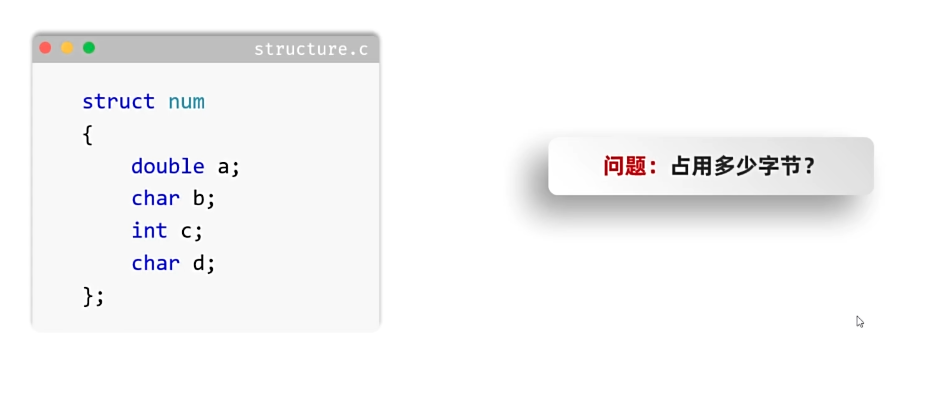
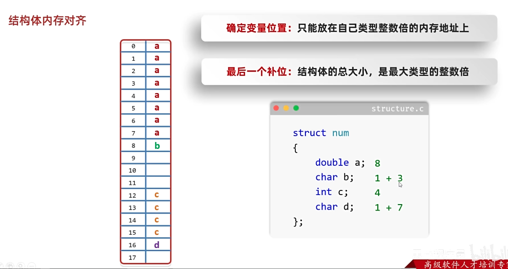
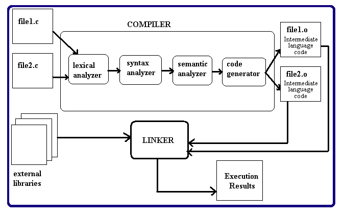
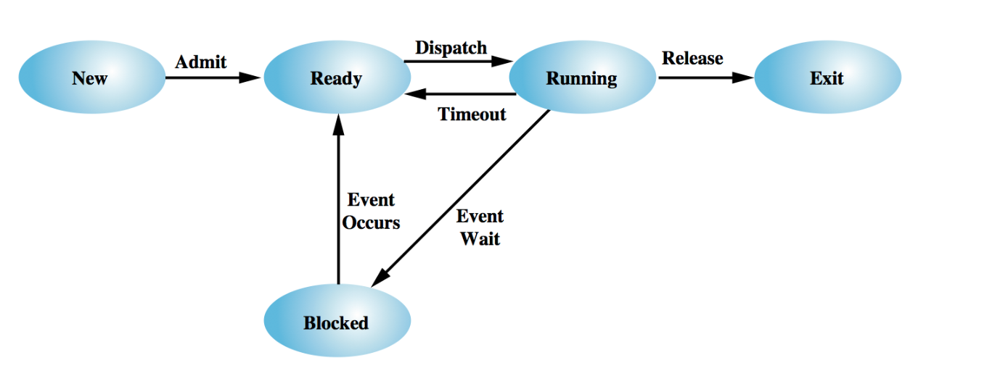
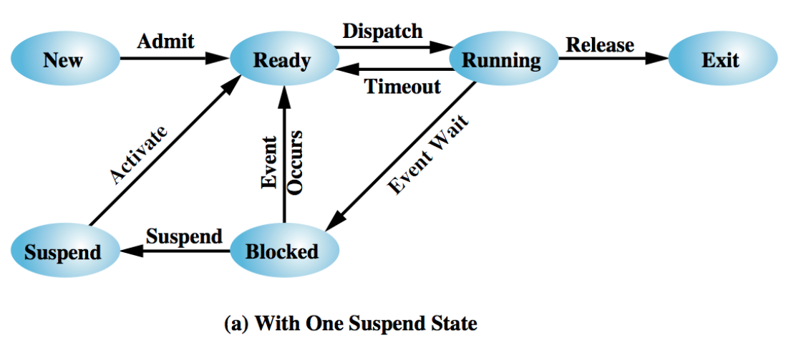
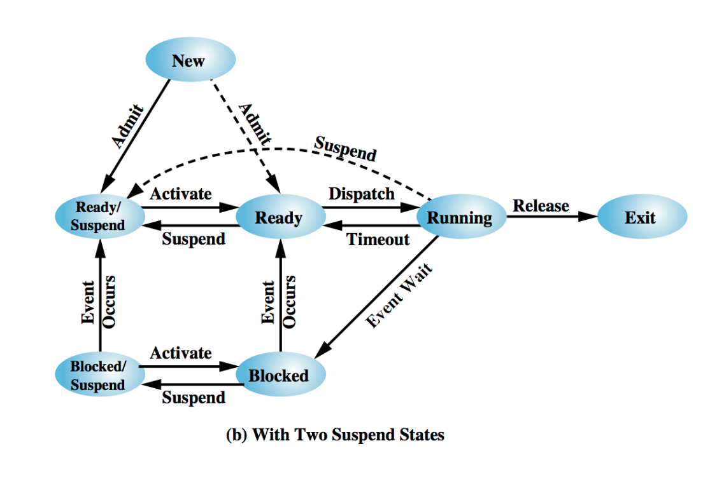

# 基础

编译命令

```
gcc hello.c -o hello
```

在命令行中传入参数

* argc：表示参数的个数
* argv：是参数列表，第0个是文件名，第1个是第一个参数，第2个是第二个参数

```c
#include <stdio.h>
#include <stdlib.h>

extern double sqrt(double x);

float square(float x)
{
    return x * x;
}

int main(int argc, char *argv[])
{
    if(argc > 2) {
      float a, b, sum;

      a   = atof(argv[1]);
      b   = atof(argv[2]);

      sum = square(a) + square(b);
      printf("hypotenuse = %f\n",
             sqrt(sum) );
    }
    return 0;
}
```

常见错误：

一下这段代码在windows上运行会先传3，后传4

在mac intel上运行会先传4，后传3

所以编译器可能会采取效率最高的代码的顺序执行，并且这个也和不同的处理器架构有关

**总之**：不能理所当然认为函数会从左到右顺序执行

~~~c
#include <stdio.h>

int square(int a)
{
    printf("square函数被调用,传入的参数为%d,返回%d\n", a, a * a);
    return a * a;
}

void sum(int x, int y)
{
    printf("sum函数被调用，传入的参数为%d和%d，sum = %i\n", x, y, x + y);
}

int main(int argc, char *argv[])
{
    sum(square(3), square(4));
    return 0;
}
~~~


static关键字(期末来补充)

```
```


生成57-69之间的随机数

```c
#include <stdio.h>
#include <stdlib.h>

int main(int argc, char *argv[])
{
    // 57 - 69
    // 12
    for (int i = 0; i < 20; i++)
    {

        int randomNum = (rand() % 13) + 57;
        printf("随机整数57-69: %d\n", randomNum);
    }

    return 0;
}
```

qsort排序

```c
#include <stdio.h>
#include <stdlib.h>

// 比较函数，用于比较两个整数
int compareInt(const void *a, const void *b)
{
    return (*(int *)a - *(int *)b);
}

int main()
{
    int arr[] = {32, 71, 12, 45, 26, 80, 53, 33};
    int n = sizeof(arr) / sizeof(arr[0]);

    // 使用 qsort 函数排序数组
    qsort(arr, n, sizeof(int), compareInt);

    // 输出排序后的数组printf("排序后的数组: ");
    for (int i = 0; i < n; i++)
    {
        printf("%d ", arr[i]);
    }
    printf("\n");

    return 0;
}
```


遍历字符数组

```c
int main(int argc, char *argv[])
{

    char arr[] = "hello\nworld";
    for (int i = 0; i < sizeof(arr) / sizeof(arr[0]); i++)
    {
        printf("%c\n", arr[i]);
    }

    return 0;
}
```


函数*open* 、 *read*和*close*不是 C11 函数，而是操作系统**系统调用**，提供用户级程序和操作系统实现之间的接口


**execv()**

该程序通过 `fork()` 创建一个子进程，然后在子进程中调用 `execv()` 来执行另一个程序（例如 `ls` 命令）。父进程将继续执行并等待子进程完成。

```c
#include <stdio.h>
#include <stdlib.h>
#include <unistd.h>
#include <sys/wait.h>

int main()
{
    // 创建一个子进程
    pid_t pid = fork();

    if (pid == -1)
    {
        // fork() 失败
        perror("fork failed");
        exit(EXIT_FAILURE);
    }
    else if (pid == 0)
    {
        // 子进程

        // 准备执行的新程序及其参数
        char *program = "/bin/ls";
        char *arguments[] = {"ls", "-l", "-h", NULL}; // 参数数组

        printf("Child Process: Executing ls command...\n");

        // 使用 execv() 执行新的程序
        execv(program, arguments);

        // 如果 execv() 失败，将执行以下代码
        perror("execv failed");
        exit(EXIT_FAILURE);
    }
    else
    {
        // 父进程

        // 等待子进程结束
        int status;
        waitpid(pid, &status, 0);

        if (WIFEXITED(status))
        {
            printf("Parent Process: Child terminated with status %d\n", WEXITSTATUS(status));
        }
        else
        {
            printf("Parent Process: Child terminated abnormally\n");
        }

        exit(EXIT_SUCCESS);
    }
}
```


读取文件

写法1，`ch == EOF`：

```c
#include <stdio.h>
#include <stdlib.h>

void fileRead()
{
    FILE *fp = fopen("./file.txt", "r");
    if (fp == NULL)
    {
        perror("open file failed:");
    }
    while (1)
    {
        char ch = fgetc(fp);
        if (ch == EOF)
        {
            break;
        }
        printf("%c", ch);
    }

    fclose(fp);
}

int main(int argc, char *argv[])
{
    fileRead();
    return 0;
}
```

写法2，用`feof`:

```c
v#include <stdio.h>
#include <stdlib.h>

void fileRead()
{
    FILE *fp = fopen("./file.txt", "r");
    if (fp == NULL)
    {
        perror("open file failed:");
    }
    while (!feof(fp))
    {
        char ch = fgetc(fp);
        printf("%c", ch);
    }

    fclose(fp);
}

int main(int argc, char *argv[])
{
    fileRead();
    return 0;
}
```

写单个字符

```c
#include <stdio.h>
#include <stdlib.h>

void fileWrite()
{
    FILE *fp = fopen("file2.txt", "w");
    if (fp == NULL)
    {
        perror("Open Failed:");
        return;
    }
    char ch = fputc('E', fp);
    printf("%c", ch);
}

int main()
{
    fileWrite();
    return 0;
}
```

写一句话

```c
#include <stdio.h>
#include <stdlib.h>
#include <string.h>

void fileWrite()
{
    FILE *fp = fopen("file2.txt", "w");
    if (fp == NULL)
    {
        perror("Open Failed:");
        return;
    }
    char str[] = "Hello file22222";
    for (int i = 0; i < strlen(str); ++i)
    {
        char ch = fputc(str[i], fp);
        printf("%c", ch);
    }
}

int main()
{
    fileWrite();
    return 0;
}
```

写入一行并读取一行

```c
#include <stdio.h>
#include <stdlib.h>
#include <string.h>

void fileReadWrite()
{
    FILE *fp = fopen("file3.txt", "w+");
    if (fp == NULL)
    {
        perror("Open Failed:");
    }
    int fputsRes = fputs("Hello file3333", fp);
    printf("result:%d\n", fputsRes);

    rewind(fp); // 把光标移到开头
    char buffer[128] = {0};
    char *fgetsRes = fgets(buffer, sizeof(buffer), fp);
    printf("Content:%s\n", fgetsRes);
    fclose(fp);
}

int main()
{
    fileReadWrite();
    return 0;
}
```

写入多行并读取多行

```c
#include <stdio.h>
#include <stdlib.h>
#include <string.h>

void fileReadWrite()
{
    FILE *fp = fopen("file3.txt", "w+");
    if (fp == NULL)
    {
        perror("Open Failed:");
        return;
    }

    // 写入多行内容
    fputs("Hello, this is the first line.\n", fp);
    fputs("This is the second line.\n", fp);
    fputs("And here is the third line.\n", fp);

    // 刷新缓冲区，确保内容写入到文件
    fflush(fp);

    // 将文件指针移到文件开头
    rewind(fp);

    // 读取并输出多行内容
    char buffer[128];
    while (fgets(buffer, sizeof(buffer), fp) != NULL)
    {
        printf("Content: %s", buffer);
    }

    fclose(fp);
}

int main()
{
    fileReadWrite();
    return 0;
}
```


# 指针

## 数组

注意指针指向arr和&arr，在+1时的区别



~~~c
#include <stdio.h>

int main()
{
    int arr[] = {10, 20, 30, 40, 50, 60, 70, 80, 90, 100};
    printf("%zu\n", sizeof(arr));
    printf("%p\n", arr);
    printf("%p\n", &arr);
    printf("移动后：\n");
    printf("%p\n", arr + 1);
    printf("%p\n", &arr + 1);
    return 0;
}
~~~

~~~
40
0x16fabb020
0x16fabb020
移动后：
0x16fabb024
0x16fabb048
~~~


另一种方式遍历数组，如下所示。但是只能得到前两个数据，原因是在使用arr1数组名进行计算的时候，退化为指向第一个元素的指针，此时不再表示数组整体了。所以计算结果为8个字节除以4个字节，length长度永远为2

```c
#include <stdio.h>

int main()
{
    // 另一种便利数组的方式
    int arr1[3] = {1, 2, 3};
    int arr2[2] = {4, 5};
    int arr3[4] = {6, 7, 8};

    int *arr[3] = {arr1, arr2, arr3};
    for (int i = 0; i < 3; i++)
    {
        int length = sizeof(arr[i]) / sizeof(int);
        for (int j = 0; j < length; j++)
        {
            printf("%d ", arr[i][j]);
        }
        printf("\n");
    }
    return 0;
}
```

```
1 2 
4 5 
6 7 
```

改进：

```c
#include <stdio.h>

int main()
{
    // 另一种便利数组的方式
    int arr1[3] = {1, 2, 3};
    int arr2[2] = {4, 5};
    int arr3[4] = {6, 7, 8};

    // 预先计算每一个数组的真实长度
    int len1 = sizeof(arr1) / sizeof(arr1[0]);
    int len2 = sizeof(arr2) / sizeof(arr2[0]);
    int len3 = sizeof(arr3) / sizeof(arr3[0]);
    // 再定义一个数组，装所有数组的长度
    int lenArr[3] = {len1, len2, len3};

    int *arr[3] = {arr1, arr2, arr3};
    for (int i = 0; i < 3; i++)
    {
        for (int j = 0; j < lenArr[i]; j++)
        {
            printf("%d ", arr[i][j]);
        }
        printf("\n");
    }
    return 0;
}
```

```
1 2 3 
4 5 
6 7 8 0 
```


## 二维数组


 

```c
#include <stdio.h>

int main()
{

    int arr[3][5] = {
        {1, 2, 3, 4, 5},
        {11, 22, 33, 44, 55},
        {111, 222, 333, 444, 555}};

    int(*p)[5] = arr;

    printf("%p\n", arr);
    printf("%p\n", arr + 1);

    for (int i = 0; i < 3; i++)
    {
        for (int j = 0; j < 5; j++)
        {
            printf("%d ", *(*p + j));
        }
        p++;
        printf("\n");
    }

    return 0;
}
```


## 函数指针

```c
#include <stdio.h>
void method1();
int method2(int a, int b);

int main()
{
    void (*p1)() = method1;
    int (*p2)(int, int) = method2;

    p1();
    int res = p2(32, 99);
    printf("%d\n", res);
    return 0;
}

void method1()
{
    printf("method1\n");
}

int method2(int a, int b)
{
    printf("method2\n");
    return a + b;
}
```

```
method1
method2
131
```


```c
#include <stdio.h>
/*
定义加减乘除四个函数
键盘录入三个数字
前两个代表计算数字
第三个代表调用的函数
*/
int add(int a, int b);
int subtract(int a, int b);
int mutiply(int a, int b);
int divide(int a, int b);

int main()
{
    // 专业术语：函数指针数组
    int (*arr[4])(int, int) = {add, subtract, mutiply, divide};

    printf("请录入两个数字参与计算\n");
    int num1;
    int num2;
    scanf("%d%d", &num1, &num2);
    printf("%d %d\n", num1, num2);
    printf("请录入一个数字进行计算\n");
    int operator;
    scanf("%d", &operator);
    int res = (arr[operator-1])(num1,num2);
    printf("%d\n", res);
    return 0;
}

int add(int a, int b)
{
    return a + b;
}

int subtract(int a, int b)
{
    return a - b;
}

int mutiply(int a, int b)
{
    return a * b;
}
int divide(int a, int b)
{
    return a / b;
}
```

```
请录入两个数字参与计算
45 21
45 21请录入一个数字进行计算
1
66
```


# 字符串

## 字符串数组

```c
#include <stdio.h>

int main()
{
    char arr[3][100] = {
        "zhangsan",
        "lisi",
        "wangwu"};
    char(*p)[100] = arr;
    for (int i = 0; i < 3; i++)
    {
        printf("%s\n", *p);
        p++;
    }
    return 0;
}
```

```
zhangsan
lisi
wangwu
```


## 常见函数

* strlen：获取字符串的长度
* strcat：拼接两个字符串
* strcpy：复制字符串
* strcmp：比较两个字符串
* strlwr：将字符串变成小写
* strupr：将字符串变成大写


# 结构体

## 作为函数参数传递

```c
#include <stdio.h>
#include <string.h>

typedef struct
{
    char name[100];
    int age;
} Stu;

void method(Stu *student);

int main()
{
    Stu stu;
    strcpy(stu.name, "Tom");
    stu.age = 19;
    method(&stu);
    printf("%s\n", stu.name);
    printf("%d\n", stu.age);
    return 0;
}

void method(Stu *student)
{
    student->age = 300;
}
```

```
Tom
300
```


## 结构体嵌套

```c
#include <stdio.h>
#include <string.h>

typedef struct
{
    char tel[100];
    char email[100];
} Message;

typedef struct
{
    char name[100];
    int age;
    Message msg;
} Student;

int main()
{
    Student stu;
    strcpy(stu.name, "Tom");
    stu.age = 33;
    strcpy(stu.msg.tel, "134221244");
    strcpy(stu.msg.email, "hello@gmail.com");
    printf("%s\n", stu.name);
    printf("%d\n", stu.age);
    printf("%s\n", stu.msg.tel);
    printf("%s\n", stu.msg.email);
    return 0;
}
```

```
Tom
33
134221244
hello@gmail.com
```


## 结构体内存对齐

下面这个是8+1+4+1=14个字节吗？不是，其实是24个字节



下面这个解析非常重要！



```c
#include <stdio.h>

typedef struct
{
    char tel[100];
    char email[100];
} Message;

typedef struct
{
    char name[100];
    int age;
    Message msg;
} Student;

typedef struct
{
    double a;
    char b;
    int c;
    char d;
} Demo;

int main()
{
    Student stu;
    printf("%zu\n", sizeof(stu));

    Demo demo;
    printf("%zu\n", sizeof(demo));

    return 0;
}
```

```
304
24
```


## 共同体


```c
#include <stdio.h>

union MoneyType
{
    int moneyi;
    double moneyd;
    char moneystr[100];
};

int main()
{
    union MoneyType money;
    // 每次只能赋一个值
    money.moneyi = 55555;

    printf("%d\n", money.moneyi);

    return 0;
}
```


# 文件

读

```c
#include <stdio.h>

int main() {
    FILE *file = fopen("example.txt", "r"); // 打开文件以只读方式
    if (file == NULL) {
        perror("无法打开文件");
        return 1;
    }

    char line[256]; // 用于存储每一行的字符数组
    while (fgets(line, sizeof(line), file) != NULL) {
        printf("%s", line); // 输出读取到的每一行
    }

    fclose(file); // 关闭文件
    return 0;
}
```

写

```c
#include <stdio.h>

int main() {
    FILE *file = fopen("example.txt", "w");

    if (file == NULL) {
        perror("Cannot open file");
        return 1;
    }

    // 使用 fputs() 写入字符串
    fputs("This is a simple line.\n", file);

    // 使用 fprintf() 写入格式化内容
    int number = 42;
    fprintf(file, "The number is: %d\n", number);

    fclose(file);
    return 0;
}
```


# 期末补充


预处理，编译，汇编，链接

Preprocessing, compilation, assembly, linking

预处理（后会生成main.i）：

* GCC会处理所有#开头的文件，宏（Macro）替换
* #ifdef 有选择性地编译部分代码

编译（后会生成main.s）：

* 将C代码转换为汇编代码。语法分析，语义分析，优化等（参考编译原理）

汇编（后会生成main.o）：

* 将编译器生成的汇编代码转为机器码

链接：

* 将目标文件main.o和标准库或其他自定义库连接起来，形成一种可执行文件




计算机的主要组件：

* CPU
* RAM
* 

CPU与内存的交互：

* 指令和数据获取：CPU通过MAR和I/O地址寄存器等从内存获取指令和数据
* 操作系统角色：管理。确保任务调度使CPU正常工作，尤其是在I/O操作完成时

内存层次结构

* 寄存器
* Cache
* RAM
* Secondary Storage


Stalling提出的5-state模型









| **Null → New**              | a new process is requested.                  |
| --------------------------- | -------------------------------------------- |
| **New → Ready**             | resources are allocated for the new process. |
| **Ready → Running**         | a process is given a time quantum.           |
| **Running → Ready**         | a process's execution time quantum expires.  |
| **Running → Blocked**       | a process requests slow I/O.                 |
| **Blocked → Ready**         | an I/O interrupt signals that I/O is ready.  |
| **Running → Exit**          | normal or abnormal process termination.      |
| **Ready or Blocked → Exit** | external process termination requested.      |


Process Termination:
[Stallings](http://www.amazon.com/Operating-Systems-Internals-Principles-Edition/dp/0133805913/ref=dp_ob_title_bk) summarises typical reasons why a process will **terminate**:

- normal termination,
- execution time-limit exceeded,
- a resource requested is unavailable,
- an arithmetic error (division by zero),
- a memory access violation,
- an invalid request of memory or a held resource,
- an operating system or parent process request, or
- its parent process has terminated.


### **内中断 (Internal Interrupt)**

**定义**：内中断是由**CPU 内部事件**引发的，通常与程序的执行过程直接相关。这些中断由处理器或程序自动触发。

#### **常见类型 (Common Types)**：

1. 算术溢出 (Arithmetic Overflow)

   ：当一个算术操作的结果超出 CPU 所能表示的范围时，会引发算术溢出中断。

   - **Example**: Division by zero or exceeding the storage size of a register.

2. 非法操作码 (Illegal Opcode)

   ：当 CPU 试图执行一条未知的或无效的指令时，会引发此中断。

   - **Example**: Attempting to execute an undefined machine code.

3. 除零错误 (Divide by Zero)

   ：当除数为零时，CPU 会引发除零错误中断。

   - **Example**: An instruction tries to divide a value by zero.

4. 页面错误 (Page Fault)

   ：当程序试图访问未在物理内存中的页面时，会引发页面错误中断。

   - **Example**: The operating system handles the situation by loading the required page into memory.

### **外中断 (External Interrupt)**

**定义**：外中断是由**外部事件**引发的，通常与系统外部硬件有关。这些中断由硬件设备或外部信号触发。

#### **常见类型 (Common Types)**：

1. I/O 设备中断 (I/O Device Interrupt)

   ：当外部设备（例如硬盘、打印机）完成 I/O 操作时，会向 CPU 发送中断信号。

   - **Example**: A hard disk signals that it has completed reading data.

2. 定时器中断 (Timer Interrupt)

   ：由系统的定时器触发，通常用于实现多任务处理和时间管理。

   - **Example**: A timer generates an interrupt every millisecond to switch between tasks.

3. 电源故障中断 (Power Failure Interrupt)

   ：当系统电源即将失效时，会触发此中断以便系统能够安全关闭。

   - **Example**: A power supply unit signals the system to save data before shutdown.

4. 外部信号中断 (External Signal Interrupt)

   ：由外部按钮（如重启键或其他控制按钮）触发。

   - **Example**: Pressing the reset button on a computer.


内中断通常不会导致进程进入阻塞态，而外中断在某些情况下可能会导致进程进入阻塞态，尤其是涉及到等待外部资源的情况。


执行fork后，栈内存和堆内存的变化

```c
#include <stdio.h>
#include <unistd.h>

int main() {
    int a = 5;

    pid_t pid = fork();

    if (pid == 0) { // 子进程
        a += 5;
        printf("Child process, a = %d\n", a); // 输出: Child process, a = 10
    } else { // 父进程
        a -= 5;
        printf("Parent process, a = %d\n", a); // 输出: Parent process, a = 0
    }

    return 0;
}
```

输出：

Parent process, a = 0
Child process, a = 10

```c
#include <stdio.h>
#include <stdlib.h>
#include <unistd.h>

int main() {
    int *ptr = malloc(sizeof(int));
    *ptr = 10;

    pid_t pid = fork();

    if (pid == 0) { // 子进程
        *ptr += 10;
        printf("Child process, *ptr = %d\n", *ptr); // 输出: Child process, *ptr = 20
    } else { // 父进程
        *ptr -= 5;
        printf("Parent process, *ptr = %d\n", *ptr); // 输出: Parent process, *ptr = 5
    }

    free(ptr); // 父进程和子进程需要各自释放堆内存

    return 0;
}
```

输出：

Parent process, *ptr = 5
Child process, *ptr = 20


**栈内存**：`fork()` 后，子进程的栈内存是父进程的拷贝，父子进程的栈是独立的。修改局部变量的值不会相互影响。

**堆内存**：`fork()` 后，父子进程共享堆内存的副本，堆中的数据最初相同，但父子进程的堆也是独立的。它们的修改不会相互影响。


Requirements of 内存管理

sharing：

允许进程共享内存

relocation：

进程被swapped out时，不太可能将该进程完全换回相同的物理位置（地址）

protection：

保护进程不受其他影响。内存保护由processor（hardware）执行，而不是operating system（software）


动态分区算法：

First- fit：找到该进程下一个未使用的内存块，从地址0开始搜索

Best-fit：找到该进程最小的位置用的内存块

Next-fit：记住最后一个内存分配的位置k，下一次开始从k搜索


三种地址：

logical address：is a reference to a memory location independent of any current assignment of data to main memory.

relative address：is a logical address expressed relative to a fixed (logical) location, such as the beginning of the process's image.

physical address：is an actual location in main (physical) memory.


分页的优点：

* More (pieces of) processes may be maintained in main physical memory (either **Ready** or **Running**).

* Most processes do not require all of their memory before they can execute: memory may be loaded on demand.
* If the swapping space is larger than the physical memory, any single process may now demand more memory than the amount of physical memory installed.


**make**

| $@   | This will always expand to the current target.               |
| ---- | ------------------------------------------------------------ |
| $<   | The name of the first dependency. This is the first item listed after the colon. |
| $?   | The names of all the dependencies that are newer than the target. |

~~~makefile
.PHONY: clean all
CFLAGS = -Wall -g -O2
targets = hello world
sources = main.c message.c
objects = main.o message.o

all: $(targets)
	@echo "all done"

$(targets): $(objects)
	gcc $(CFLAGS) $(objects) -o $@

%.o: %.c
	gcc $(CFLAGS) -c $<

clean:
	-rm -rf *.o hello
~~~

